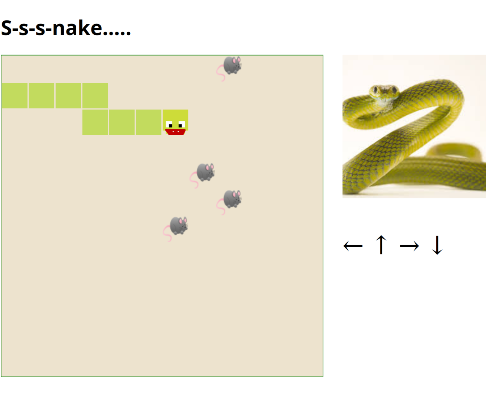

# Descripción

Este proyecto es un juego clásico de la serpiente ("Snake"), desarrollado en TypeScript y utilizando jQuery para la manipulación del DOM. El objetivo es mover la serpiente por el tablero, comer ratones y evitar chocar con las paredes o con su propio cuerpo. Cada vez que la serpiente come un ratón, crece en tamaño y el jugador acumula puntos.

## Características

    🐍 Movimiento fluido de la serpiente en un tablero de 12x12 celdas.
    🐭 Ratones aleatorios: Los ratones aparecen en ubicaciones aleatorias del tablero.
    🎨 Diseño visual:
        La serpiente tiene una textura verde.
        Los ratones tienen una imagen específica (mouse.png).
        La cabeza de la serpiente y la animación de "comer" tienen texturas distintas.
    🎵 Efectos de sonido: Un sonido de "comer" (swallow.mp3) se reproduce al capturar un ratón.
    🛑 Detección de colisiones: El juego termina si la serpiente choca contra sí misma.
    ⚙️ Diálogo de reinicio: Se muestra un diálogo al final del juego con la puntuación obtenida y la opción de reiniciar la partida.

## Tecnologías utilizadas

    Lenguaje: TypeScript
    Bibliotecas: jQuery
    Recursos gráficos: Archivos PNG para representar los elementos del juego.
    Sonido: Archivos MP3 para los efectos.

## Estructura del proyecto 
```
src
├── index.html           # Archivo principal de la interfaz
├── main.ts              # Lógica principal del juego
└── public
     ├── snake.css            # Estilos del juego
     ├── mouse.png            # Imagen del ratón
     ├── snakemove.png        # Imagen de la cabeza de la serpiente
     ├── snakeeat.png         # Imagen de la serpiente comiendo
     └── swallow.mp3          # Sonido al comer un ratón
```
## Cómo jugar

    Mover la serpiente:
        Usa las teclas de flecha:
            ⬆️ Flecha Arriba: Mover hacia arriba.
            ⬇️ Flecha Abajo: Mover hacia abajo.
            ⬅️ Flecha Izquierda: Mover hacia la izquierda.
            ➡️ Flecha Derecha: Mover hacia la derecha.
        Nota: No puedes girar la serpiente 180° directamente.

    Comer ratones: Dirige la cabeza de la serpiente hacia el ratón para "comerlo". Esto incrementará el tamaño de la serpiente.

    Evitar colisiones: No choques contra las paredes ni contra el cuerpo de la serpiente, o el juego terminará.

    Reiniciar el juego: Si pierdes, aparecerá un cuadro de diálogo con la opción de reiniciar.

## Cómo configurar y ejecutar el proyecto

Clonar el repositorio:
```bash
git clone https://github.com/Lindenson/SnakeTypeScript
```
```bash
npm install
```
Compilar TypeScript a JavaScript:
```bash
npx tsc
npx vite build
```
Abrir el archivo HTML: Abre index.html en tu navegador para comenzar a jugar.
```bash
node server.js
```
## Personalización

    Tamaño del tablero: Actualmente, el tablero es de 12x12. Puedes modificar el tamaño cambiando las dimensiones en el archivo main.ts.
    Velocidad del juego: Ajusta las constantes STEP_RATE_SECONDS y MOUSE_RATE_SECONDS para cambiar la velocidad de movimiento de la serpiente y la aparición de ratones.
    Gráficos y sonidos: Cambia las imágenes PNG o el archivo MP3 en el proyecto para personalizar la apariencia y los efectos del juego.


## Futuras mejoras

    🌟 Implementar niveles de dificultad.
    🌟 Incluir puntuaciones máximas (high scores).
    🌟 Agregar obstáculos en el tablero.
    🌟 Crear una versión multijugador.

# Imagines


# Créditos

Desarrollado por Miguel, utilizando TypeScript y jQuery.
Para consultas o sugerencias, contacta a través de Miguel de Tilo.

¡Disfruta el juego! 🎮🐍

